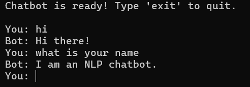
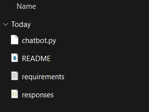

# 🧠 Offline NLP Chatbot (Python)

An offline AI chatbot designed for environments where **API access is limited, costly, or privacy-sensitive**.

---

## 🚀 Overview

This project implements a lightweight NLP-based chatbot that runs entirely locally — with **zero API cost** and low latency.

It uses text preprocessing and fuzzy matching to understand user input and respond intelligently.

---

## 💡 Why This Matters

Most AI chatbots depend on cloud APIs, which:

* Increase cost per request
* Require internet access
* Raise privacy concerns

This chatbot solves that by:

* Running fully offline
* Processing data locally
* Supporting document-based queries

---

## ⚙️ Features

* Intent recognition using fuzzy matching
* Text preprocessing and cleaning
* JSON-based response system
* 📄 PDF-based question answering (local documents)
* ⚡ Low-latency local processing
* 🔒 No external API dependency (₹0 cost per query)

---

## 🛠 Tech Stack

* Python
* NLP (basic text processing)
* fuzzywuzzy
* JSON
* pypdf

---

## 📂 Project Structure
```
chatbot_project/
├── chatbot.py
├── responses.json
├── requirements.txt
└── README.md

---

## ▶️ How to Run

```bash
pip install -r requirements.txt
python chatbot.py
```

---

## 💬 Example

**User:** What is this document about?
**Bot:** This document discusses [extracted summary...]

---

## 📊 Key Highlights

* Runs completely offline
* Zero API cost per request
* Can process local PDF documents
* Designed for low-connectivity environments

---

## 🎯 Use Cases

* Internal tools for companies with sensitive data
* Educational tools in low-internet regions
* Lightweight AI assistant for local systems

---

## 👨‍💻 Author

Vivek Devda
B.Tech AI & ML Student


## Demo

### Chatbot Working



### Project Folder Structure


